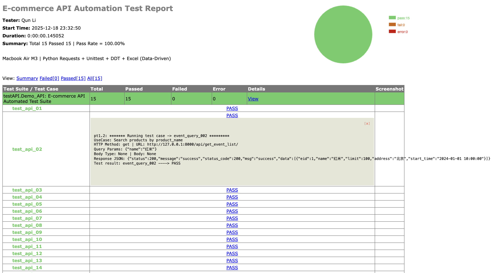
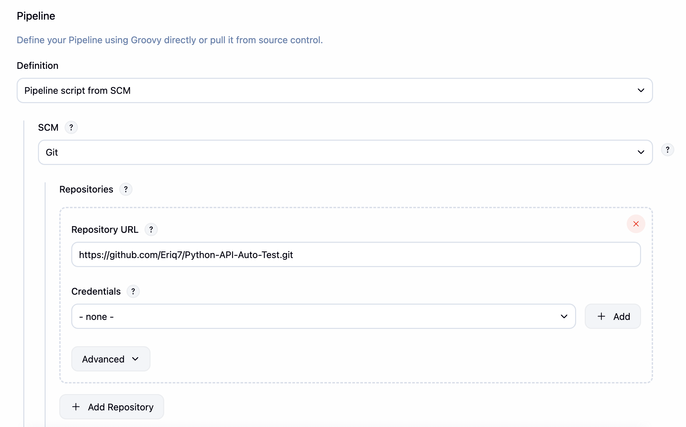
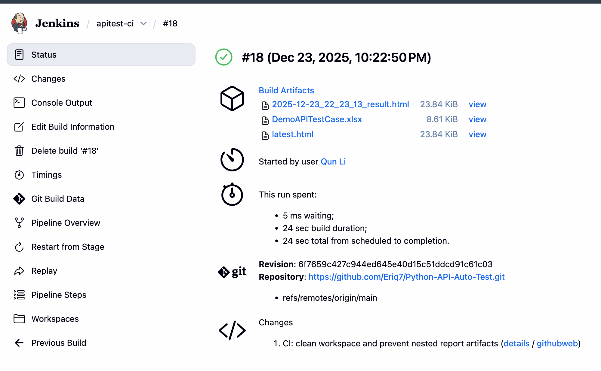

# DemoAPI – API Automation Testing Framework

---

## 📌 Overview

This project is not just an API test suite — it is a **containerized, CI-driven API testing platform** designed to demonstrate how real-world backend testing is built and operated.

### 🚀 What This Project Demonstrates

- 🧩 **Framework-oriented API testing**  
  API tests are structured as a reusable framework instead of scattered scripts.

- 📊 **Data-driven testing (Excel → API → Report)**  
  Test cases, parameters, and expected results are managed in Excel for traceability.

- 🐳 **Fully Dockerized execution**  
  Both the **target API** and the **test runner** run in containers to guarantee environment consistency.

- ⚡ **FastAPI-based testable backend**  
  A real FastAPI service is provided so tests run against an actual HTTP system.

- 🔁 **CI-driven regression testing**  
  Jenkins pulls the repo, builds containers, runs tests, and archives HTML + Excel reports automatically.

---

### 🧠 Why This Matters

In real backend teams, API tests must be:

- **Repeatable** → same result on every machine  
- **Traceable** → each test maps to business cases  
- **Automatable** → runnable by CI without manual setup  

This project shows how those goals are achieved using **FastAPI + Docker + Jenkins + Python test frameworks**.

---

### 💡 When This Kind of Framework Is Useful

This approach is especially suitable for:

- **Small to mid-sized backend systems**
- **Teams that rely heavily on API regression testing**
- **Projects where test cases change frequently and must remain traceable**

---

The framework is built using:

- **Python 3**
- **unittest**
- **DDT (Data-Driven Testing)**
- **Excel** for test case & test data management
- **HTMLTestRunner** for automated HTML report generation
- **FastAPI** (target API + optional test trigger service)
- **Docker & Docker Compose** (containerized environment + service networking)
- **Jenkins CI/CD** (pipeline from SCM + artifact archival)

---

## ❓ Why Build a Custom API Testing Framework?

Although there are many open-source API testing tools such as **Postman** and **JMeter**, they have several practical limitations in real projects.

### Key Limitations of Existing Tools

- **Test data is not controllable**  
  When API response data changes dynamically, it becomes difficult to perform stable assertions.  
  Failures may be caused by **code defects** or by **test data changes**, which are hard to distinguish.  
  Therefore, **test data initialization** and controlled test data are required.

- **Limited extensibility**  
  Many open-source tools are difficult to extend.  
  Customizing **test report formats** or integrating API tests into **CI pipelines** for scheduled execution is often inconvenient or unsupported.

---

## 🔁 API Testing Framework Workflow

Below is a sample HTML test report generated by this framework:



### Overall Workflow

1. Call the **target system APIs** using **data-driven testing**, reading test cases line by line from Excel.
2. Send API requests and compare API responses with expected values defined in Excel.
3. Use the **unittest** framework to assert API responses and generate **HTML test reports**.

---

## 🐳 Docker + FastAPI + Jenkins CI/CD

### Containerized Architecture (3 Services)

This project runs as **three containers** (Docker Compose):

- **target-api**: FastAPI target system under test (SUT)
- **trigger**: test runner container (executes `python run_demo.py` inside a clean environment)
- **jenkins**: CI orchestrator (pulls repo → compose up → run tests → archive reports)

Key CI design choices:

- Tests are executed **inside the `trigger` container**, so Jenkins node does not need Python dependencies installed.
- Services communicate via the **Docker Compose network** (e.g., `http://target-api:8000`).
- Jenkins archives the generated artifacts (HTML report + Excel result file) after each run.

---

## 🤖 Jenkins CI Evidence (Screenshots)

### Jenkins Job Setup (Pipeline from SCM)



### CI Build Passed + Artifacts Archived



---

## 📂 Project Directory Structure

| Directory / File | Description |
|------------------|-------------|
| `config/` | Path and environment configuration files |
| `database/` | Test case templates and configuration files |
| `lib/` | Core framework modules (Excel read/write, request handling) |
| `package/` | Third-party libraries (HTMLTestRunner) |
| `report/` | Generated API automation test reports |
| `testcase/` | API automation test cases |
| `run_demo.py` | Main entry script to execute all API test cases |
| `app.py` | FastAPI target API service (SUT) |
| `api_trigger.py` | Optional FastAPI trigger service (`/run-tests` → runs `run_demo.py`) |
| `docker-compose.yml` | Orchestrates `target-api` + `trigger` + `jenkins` containers |
| `Dockerfile` / `Dockerfile.jenkins` | Container build definitions |
| `Jenkinsfile` | Jenkins pipeline: compose up → wait readiness → run tests → archive artifacts |

---

## ▶️ How to Run This Project

> **Note:** This is a public demonstration project.  
> Environment-specific configurations (database credentials, email accounts) are intentionally excluded.

### 1. Environment Setup

- Python 3.x
- Required Python packages:
  - requests
  - unittest
  - ddt
  - openpyxl

### 2. Configuration

Create a local configuration file based on the example template:

```bash
cp database/config.ini.example database/config.ini
```

Fill in your local database and email configuration if you want to execute the project end-to-end.

### 3. Execute Tests (Local Python)

Run the main entry script:

```bash
python run_demo.py
```

After execution, an HTML test report will be generated under the `report/` directory.

### 4. Execute via Docker Compose (CI-Consistent)

```bash
docker compose up -d --build
# run tests inside trigger container (same style as CI)
docker compose exec -T trigger python run_demo.py
```

Reports will be generated in the container and can be copied/archived by CI.

---

## ✅ Notes for Reviewers

- This repository focuses on **framework design and structure**, not environment-specific setup.
- Sensitive configuration files are excluded for security reasons.
- The project is designed to be **readable, extensible, and CI-friendly**.
- ✅ CI pipeline produces reviewable artifacts (HTML report + Excel result sheet) for each Jenkins build run.
